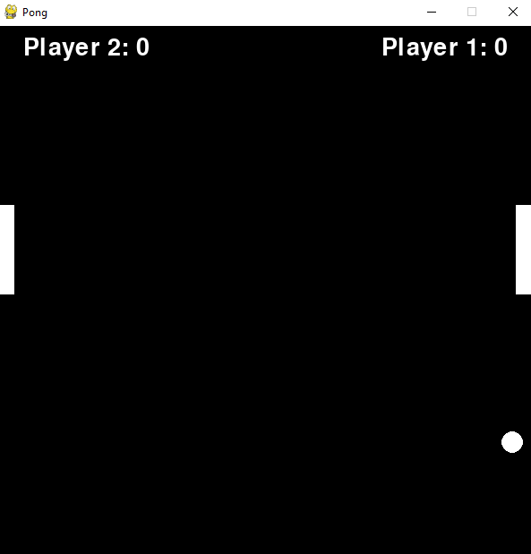

# Pong

## This is a simple Pong game made with PyGame

## How to play
* Start the game by running python pong.py
* Click `Start Game`
* Player 1:
    Use Up and Down arrow keys
* Player 2:
    Use W and S keys

